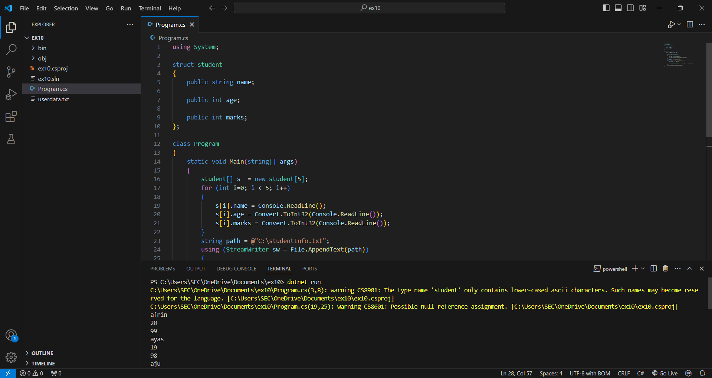

# 19AI308-Object-Oriented-Programming-using-CSharp-Exp-10-File-Manipulation
Develop a C# program to get the values from the user using structure and store it in a file in a specific path using file stream concept

## AIM:
To develop a C# program using file streams.

## ALGORITHM :
### Step 1 :
Define a structure UserData to hold user data fields like name, age, and email.

### Step 2 :
Create an array of UserData to store multiple user data entries. Use a loop to prompt the user to input their name, age, and email, and store the input in the array.

### Step 3 :
Specify the file path where the user data will be stored.

### Step 4 :
Inside the loop, for each user data entry, open the file in append mode using StreamWriter and write the user data to the file.

### Step 5 :
Close the file after writing all user data.

### Step 6 :
Display a message indicating that the user data has been saved to the file.

## PROGRAM :

```C#
DEVELOPED BY : JAYABHARATHI S
REG NO : 212222100013


using System;

struct student
{
    public string name;

    public int age;

    public int marks;
};

class Program
{
    static void Main(string[] args)
    {
        student[] s  = new student[5];
        for (int i=0; i < 5; i++)
        {
            s[i].name = Console.ReadLine();
            s[i].age = Convert.ToInt32(Console.ReadLine());
            s[i].marks = Convert.ToInt32(Console.ReadLine());
        }
        string path = @"C:\studentInfo.txt";
        using (StreamWriter sw = File.AppendText(path))
        {
            for (int i = 0; i < 5; i++)
            {
                sw.WriteLine(s[i].name + " " + s[i].age + " " + s[i].marks);
            }
        }
        Console.WriteLine(File.ReadAllText(path));
    }
}

```
## OUTPUT :


## RESULT :
Thus the C# program to get the values from the user using structure and store it in a file in a specific path using file stream concept executed successfully.
